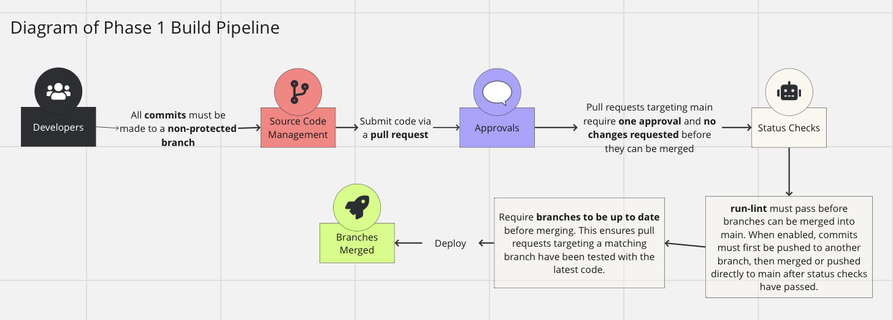

# Pipeline: Phase 1 Overview

## Current Funcitonality   

### Codacy

* Code quality metrics reporting
  * Quality evolution chart tracks quality of issues, complex files, duplication, and code coverage. Currently based on Codacy default quality gates.
 
* Automatic issue generation and breakdown by severity and category when a commit is pushed
  * New commits must generate 0 new issues in order to proceed.

* Requires these default quality thresholds to be met before merging (May revise in the future)

### Branch Protection Rules

* Require a pull request before merging.
  * All commits must be made to a non-protected branch and submitted via a pull request before they can be merged into a branch that matches `main`.
 
* Require approvals
  * Pull requests targeting `main` require one approval and no changes requested before they can be merged.
 
* Require status checks to pass before merging
  * `run-lint` must pass before branches can be merged into `main`. When enabled, commits must first be pushed to another branch, then merged or pushed directly to `main` after status checks have passed.
  * (Tentative) Require branches to be up to date before merging. This ensures pull requests targeting a matching branch have been tested with the latest code.

* Lock branch 
  * `main` is read-only. Users cannot push to `main`.

* Do not allow bypassing the above settings

### Unit Testing

* Tests found in `__tests__/index.test.js` run when a pull request is created
  * These ensure that any html files pushed to `main` have the correct basic structure.

* More types of tests to be added in the future, possibly some E2E as well

### JSDocs

* All functions should be documented with a description, parameters, and return values
  
* Generates automatic documentation in `out` folder upon pushing
  * Documentation can be viewed at `out/index.html`.

