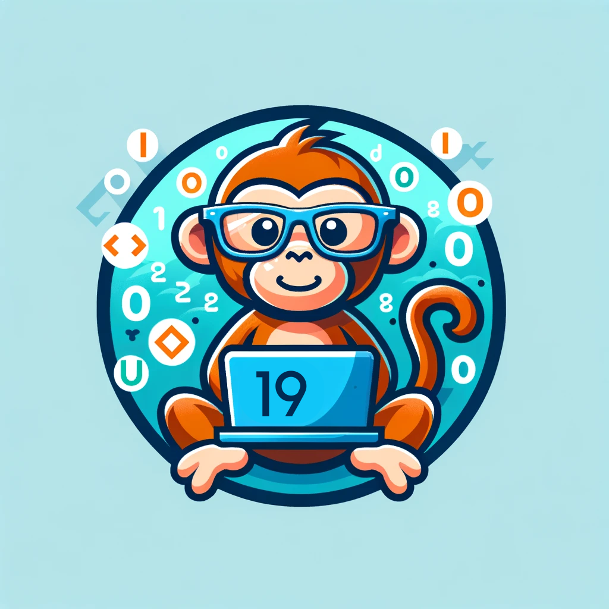

# Team Coding Monkeys
<!--  

-->

## Roster and Tentative Roles (Links to Personal Github):
- [Milana Gorobchenko](https://github.com/milgor931) Team Lead 
  
  <!---->
  > BRIEF OVERVIEW OF MEMBER
- [Riana Ali](https://github.com/rianaali): Team Lead  
  
  <!---->
  > BRIEF OVERVIEW OF MEMBER
- [Julie Hong](https://github.com/Julie110): NULL  
  
  <!---->
  > BRIEF OVERVIEW OF MEMBER
- [Charlie Trinh](https://github.com/charlitoes): Backend, Algorithm Design 
  
  <!---->
  > BRIEF OVERVIEW OF MEMBER
- [Xu Wenzhe](https://github.com/Markcmd): NULL  
  
  <!--.jpeg)-->
  > BRIEF OVERVIEW OF MEMBER
- [Ginger Smith](https://github.com/gingersmith4): Frontend / Backend 
  
  <!---->
  > Hello 👋 my name is Ginger and I'm a third year studying computer science! I'm minoring in French 🇫🇷  literature and am in ERC. Some of my hobbies are crochet 🧶 and ukelele! 🎶 
- [Brandon Panuco](https://github.com/bpanuco11): Backend 
  
  <!---->
  > Hi my name is Brandon and I am a transfer student from Imperial Valley College majoring in Computer Science. During my spare time I like to watch the premier league
  and take my dogs for a walk to the park.
- [Nikolas Yanek](https://github.com/nikothomas): Frontend 
  
  <!---->
  > BRIEF OVERVIEW OF MEMBER
- [Julio Rivas](https://github.com/jrivas112): NULL 
  
  <!---->
  > BRIEF OVERVIEW OF MEMBER
- [Allison Lane](https://github.com/a4lane): NULL 
  
  <!---->
  > BRIEF OVERVIEW OF MEMBER
- [David De-santiago](https://github.com/ddesantiag0): NULL 
  
  <!---->
  > BRIEF OVERVIEW OF MEMBER

## Team Standards and Values:

**Communication:**
1. Always communicate when unable to attend a meeting.
2. Maintain responsiveness by checking Slack at least once a day.
3. Foster open communication between team members whose responsibilities overlap.
4. Communicate the reasons and deadlines for task completion.

**Respect:**
1. Inquire if anyone has questions at the beginning of every meeting.
2. Ensure everyone has clarity on the agenda, expectations, and project status during meetings.
3. Respect people's time by having a clear agenda and purpose for meetings.

**Responsibility and Accountability:**
1. Rotate the responsibility for submitting assignments and clarify who is submitting what.
2. Have submissions ready 2-3 days before the due date to account for any delays.

**Honesty and Realism:**
1. Be honest and communicate if a task isn't suitable for you or if you prefer to work on something else.
2. Be realistic about what you can accomplish and communicate deadlines accordingly.

### Team Culture:
Our team culture is built on the foundation of effective communication, deep respect for one another, unwavering responsibility and accountability, and a commitment to honesty and realism. We will win as a team and lose as a team, no code monkey is an island.
